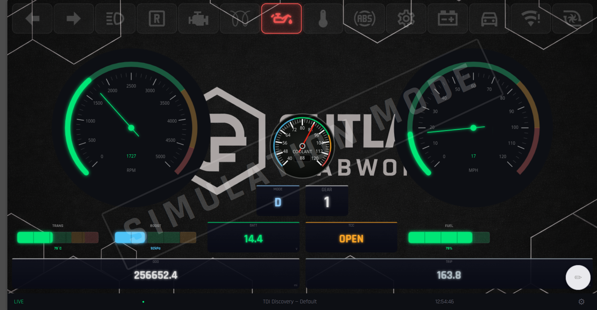

# Overdash

Open-source digital dashboard for Raspberry Pi. Most commercial Pi-based dash solutions lock you into a single ECU brand and require paid third-party software licenses. Overdash doesn't: it speaks **J1939 CAN, OBD-II K-line, ELM327, CAN OBD, GPS, and GPIO** natively, so it works with engine swaps, custom builds, and vehicles that commercial options simply don't support.

A Python async backend reads from any combination of those sources simultaneously and streams everything over WebSocket to a Chromium kiosk frontend. Gauges are rendered on canvas, and the layout is fully editable in-browser with a visual no-code editor. No paid software required.

Built for a TDI-swapped Land Rover Discovery (J1939 engine + CompuShift Sport TCM + ZF4HP22EH), but config-driven; no code changes needed to adapt it to another vehicle.



---

## Features

- **Multiple data sources**: J1939 CAN, CompuShift TCM, OBD-II (K-line and ELM327), CAN OBD, Megasquirt/Speeduino USB serial, GPS (NMEA), analog ADC, frequency counter, GPIO inputs, and a mock source for development without hardware
- **Visual no-code layout editor**: drag to move, resize handles, properties panel for zones/thresholds/colors, gauge palette, theme picker, save to server or export JSON
- **Gauge types**: circular sweep (tach, speedo), vertical/horizontal bar, large numeric with value mapping, indicator lights, warning light strip with DTC panel
- **DTC monitoring**: Mode 03 (stored) + Mode 07 (pending) codes, MIL status, tap any active warning light to open the fault code panel
- **Odometer**: integrates vehicle speed into a persisted lifetime total and resettable trip counter
- **PWA**: add to home screen on a tablet for fullscreen landscape kiosk mode
- **Auth-protected HTTP API**: layout save/load, signal snapshot, trip reset, odometer set, per-source simulation mode

---

## Quick start

```bash
# Clone
git clone https://github.com/outlandfabworks/overdash.git
cd overdash

# Create a virtual environment and install dependencies
python3 -m venv .venv
.venv/bin/pip install -r requirements.txt

# Test with the mock vehicle source (no hardware required)
.venv/bin/python -m backend.main configs/vehicles/mock.yaml

# Open http://localhost:8080 in a browser
```

For full installation on a Raspberry Pi (CAN setup, systemd service, Chromium kiosk), see [INSTALL.md](INSTALL.md).

---

## Project structure

```
backend/
  main.py                     Entry point: wires sources, processors, servers
  data_bus.py                 In-memory signal store with asyncio pub/sub
  config.py                   YAML loader
  sources/
    base.py                   Abstract DataSource
    can_j1939.py              J1939 PGN/SPN decoder (python-can)
    can_compushift.py         CompuShift Sport TCM CAN messages
    can_obd.py                OBD-II over CAN (ISO 15765-4)
    obd_kline.py              ISO 9141-2 / KWP2000 K-line poller
    elm327.py                 ELM327 USB/Bluetooth OBD adapter
    megasquirt.py             Megasquirt 1/2/3 and Speeduino USB serial
    gps_nmea.py               GPS via NMEA serial stream
    analog_adc.py             Analog voltage/sensor via SPI ADC (MCP3xxx)
    frequency_counter.py      RPM/frequency via GPIO pulse counting
    gpio_inputs.py            Overdash Input HAT (turn signals, lights, reverse)
    mock_vehicle.py           Simulated signals for dev/testing
  processors/
    odometer.py               Integrates vehicle_speed → odometer + trip signals
  server/
    websocket.py              WebSocket broadcast server (30 Hz)
    http_api.py               HTTP API + frontend file serving (port 8080)

frontend/
  index.html                  Shell: loads layout, connects WebSocket
  manifest.json               PWA manifest (fullscreen, landscape)
  js/
    ws_client.js              WebSocket client with auto-reconnect
    layout.js                 CSS grid layout builder from JSON config
    gauge_registry.js         Plugin registry for gauge types
    gauges/
      base.js                 BaseGauge (canvas helpers, zone color lookup)
      circular.js             Circular/sweep gauge (tach, speedo)
      bar.js                  Vertical/horizontal bar gauge
      numeric.js              Large-number display with value_map support
      indicator.js            Single signal indicator light
      lights.js               Warning light strip with DTC panel
      light_icons.js          SVG icon definitions for warning lights
  editor/
    editor.js                 Visual layout editor (drag, resize, save)
    editor.css                Editor chrome and panel styles
    palette.js                Gauge palette sidebar
    properties.js             Gauge properties panel
    drag_grid.js              Grid snap and drag logic
  css/
    base.css                  Layout chrome, status bar
    themes/dark.css           Dark theme CSS variables
    themes/light.css          Light theme CSS variables

configs/
  vehicles/
    tdi_discovery.yaml        TDI Land Rover: J1939 + CompuShift + K-line
    generic_modern.yaml       Modern petrol/diesel: ELM327 or CAN OBD
    generic_obd2.yaml         Older OBD-II vehicle: K-line only
    offroad_expedition.yaml   Off-road build with GPS + ADC sensors
    mock.yaml                 Mock source: no hardware needed
  layouts/
    tdi_discovery.json        Default layout for the TDI Discovery

hardware/
  overdash-input-hat/          KiCad schematic and PCB for the GPIO input HAT
```

---

## Signal flow

```
Hardware  →  Source._read_loop()  →  DataBus.publish(name, value, unit)
                                           │
                                   OdometerProcessor (vehicle_speed → odometer/trip)
                                           │
                                   WebSocketServer (batches at 30 Hz)
                                           │
                                   Browser WSClient
                                           │
                                   LayoutManager.update(signals)
                                           │
                                   Gauge.draw(value)  →  <canvas>
```

---

## Adding a gauge type

1. Create `frontend/js/gauges/my_gauge.js` extending `BaseGauge`, implement `draw(value)`.
2. Register it in `index.html`: `GaugeRegistry.register('my_gauge', MyGauge)`.
3. Add a gauge entry in the layout JSON with `"type": "my_gauge"`.

## Adding a data source

1. Create `backend/sources/my_source.py` extending `BaseSource`, implement `_read_loop()`.
2. Register it in `backend/main.py`: `_SOURCE_TYPES['my_source'] = MySource`.
3. Add a source entry in the vehicle YAML with `type: my_source`.

---

## TDI Discovery: signal reference

| Signal | Source | Notes |
|--------|--------|-------|
| `engine_rpm` | J1939 PGN 61444 SPN 190 | EEC1 |
| `coolant_temp` | J1939 PGN 65262 | ET1 |
| `intake_map` | K-line PID 0x0B | Absolute kPa (doubles as boost) |
| `vehicle_speed` | J1939 PGN 65265 | CCVS1 |
| `trans_current_gear_label` | CompuShift CAN 0x3E0 | P/R/N/D/3/2/1 |
| `trans_tcc_lockup` | CompuShift CAN 0x3E0 | 0 = open, 1 = locked |
| `trans_temp` | CompuShift CAN 0x3E1 | °C |
| `battery_voltage` | J1939 PGN 65271 | VEP1 |
| `odometer` | Processor | Persisted lifetime km |
| `trip` | Processor | Resettable trip km |

## CompuShift Sport CAN IDs

Default map derived from community reverse-engineering (Sport firmware ≥ 2.x).
Override via `messages:` in the vehicle YAML if your TCM uses different IDs.

| CAN ID | Content |
|--------|---------|
| 0x3E0 | Current gear, target gear, TCC status, shift mode |
| 0x3E1 | Trans temp |
| 0x3E2 | Line pressure, error codes |

---

## License

MIT. See [LICENSE](LICENSE). Third-party license notices in [THIRD_PARTY_LICENSES.md](THIRD_PARTY_LICENSES.md).
